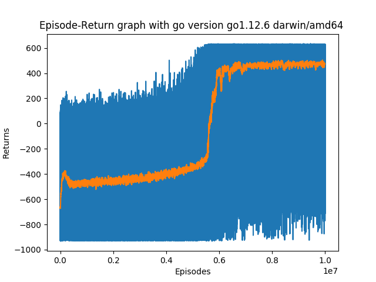

# anylang-rl

いろんな言語で強化学習します。

## 目的

上に行くほどメインの目的です。

- いろんな言語の習得
- ついでにベンチもとってみたい

## 必要なもの

### 必須

- make コマンド
- time コマンド
- imagemagick
- python3 >= 3.7
  - numpy
  - matplotlib

### 任意

- julia
- go
- ruby
- c
  - 別途 SFMT が必要です
  - clang
- Rust
    - cargo
    - rustc

## 使い方

言語の各フォルダで

```
make
```

でいろいろビルドとかします。

```
make run
```

で実行時間を計りつつ実験をします。

```
make images
```

で実験結果をプロットしたりします。

各言語についてこれらをやるのはだるいので，`make_caller` スクリプトを書きました。
使い方は，

```
./make_caller run
```

とかそんな感じです。
`-j` オプションで並列実行数を指定できます。

## 実験について

### 概要

倒立振子の振り上げタスクを予定しています。

### 結果の例

#### 倒立しているアニメーション


#### 学習曲線

青が実際に得られた収益で，オレンジが移動平均です。



## 言語の比較

(TODO)
